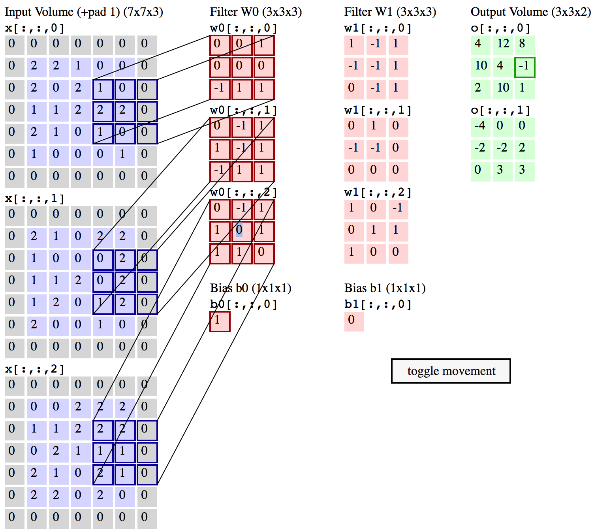
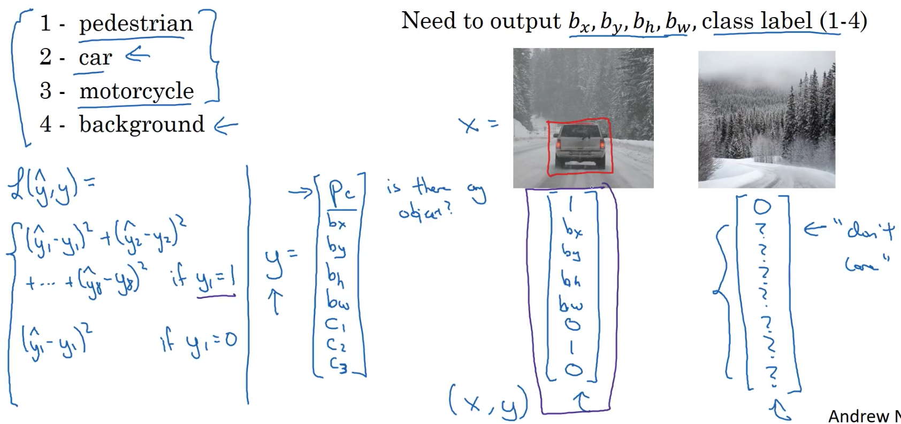

# Deep Learning Review
## CNN
### What is the process of convolution?
Given an image, we would use a filter/ kernel to do convolution step.

Here we use two filters of size 3 x 3, and they are applied with a stride of 2 and a padding of 1. Therefore, the output column size is $(5-3+2)/2+1=3$.
The filter and the selected part in the image would operate a element-wise multiplication, which means $\sum Input_{ij}*Filter_{ij}$.
This technique can be used for edge detection.

So which filter should we choose?
* Sobel filter: the advantage is that you can put a little bit more weight wo the central pixel and this makes it more robust.

* Scharr filter: optimizes Sobel filter.

However, the best choice maybe that we can learn the filter by treating the filter as nine parameters which we can learn by backpropogation.
One downside of filter is that every time you use a filter, the image shrink, so you can only do this a few times until the image becomes very small. The other downside is that the corner of this picture is touches only once, while the 3 x 3 filter overlaps a lot of time at the central pixel, so you are throwing away many information near the edge. So that is why we use pad.

Valid convolution: n x n * f x f -> n-f+1 * n-f+1
Same convolution: output size is the same as input size. $p=\frac{f-1}{2}$
Usually the size of filter is an odd number.

Strided convolution: instead of using a filter to slide within the image one step each time, we change step size to number of stride.

Summary: for a n x n image and f x f filter with padding p and stride s, the output image size would be $\lfloor \frac{n+2p-f}{s}+1 \rfloor$.

Convolutions on RGB images
Given a image of size height * width * #channels, and a filter with 3 * 3 * #channels the output size is height-3+1 * width-3+1. (from 3d image to 2d output)

What if we want to use multiple filters at the same time, say that one detect horizontal edge, one detect vertical edge, we would get an out put of size height-3+1 * height-3+1 * #filters.

One good thing is that no matter how big the size of image is the parameters the model trying to learn is fixed, say that we have 10 filters that are 3 x 3 x 3 in one layer of a NN, 10 * (27+1bias) = 280 parameters. If the image size becomes bigger, it won't affect the number of parameters that we need to learn. Less prone to overfitting.

Pooling: 
* max pooling: 

Pooling reduce the spatial size of image and reduce the amount of parameters in the network, and hence control overfitting. Intuition: for example in the image, the left corner is a small number, maybe the feature we want to find doesn't exist in the left corner.
Pooling has no parameters to learn.
* Average pooling

### Why convolutions
1. parameter sharing: a feature detector that's useful is one part of the image is probably useful in another part of the image. (e.g. share nine parameters)
2. sparsity of connections: in each layer, each output value depends on a small number of inputs. (e.g. each number in the output of filter depends on a small region in the image)

### Classic Network
* LeNet - 5
* AlexNet
* VGG - 16 (16 layers)
* ResNet: skip connections which allow you to take the activation from one layer and suddenly feed into a deeper layer. (prevent gradient vanishing and exploding, can go much deeper). However, plain network can hurt performance when the network goes deeper.

## object detection
### object localization
classification problem uses softmax to output the class. Locolization problem  add an output of four numbers: $b_x$, $b_y$, $b_h$, $b_w$ for bounding box. $b_x$ and $b_y$ is the center of bounding box.

